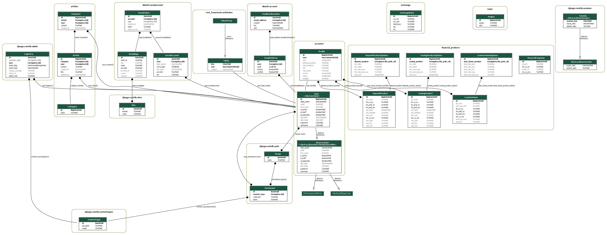

# [여러분의 맞춤형 도우미 : mini_sim]

## 사용자 맞춤 금융 상품 추천 웹 어플리케이션 개발 프로젝트

---

### ✨ **프로젝트 소개**

#### 0. 팀원 정보 및 업무 분담 내역

- 심규영 : 금융 맞춤 추천 알고리즘 구현, 은행 찾기, 더미데이터 생성, UX/UI 화면 구현

- 이정민 : 금융상품 정보, 환율계산기, 프로필 페이지

#### 1. 사용 언어 & 프레임워크

- 사용 언어 : Python, Vue, JavaScript, HTML

- 프레임워크
  
  - BACK : Django REST Framework
  
  - FRONT : Vue3

#### 2. 일정(실제 구현 정도)

- 총 개발 기간 : 2023.11.16.~2023.11.24.

- 세부 일정
  
  - 16~19 : 프로젝트 설계도 작성 및 기본 부분 틀 구축
    
    - 메인
    
    - 커뮤니티
    
    - 회원 페이지
    
    - 프로필 페이지
  
  - 20~21 : 금융 부분 틀 구축
    
    - 지도 구현
    
    - 프로필 페이지
    
    - 환율 계산기
    
    - 금융 상품 데이터 수집 및 저장(API 활용) 
    
    - 금융 상품 목록 구현
  
  - 22~23 : 더미 데이터 생성 및 알고리즘 개발, UX/UI 개선
    
    - 금융 상품 목록 세분화 및 상세 페이지 구현 
    
    - 10,000명 랜덤 더미데이터 생성
    
    - 금융 상품 추천 알고리즘 개발
    
    - 사용자 중심 UX/UI 개선

- 실제 구현 정도 : 99.9%

##### 3. 버전 관리

- 0.1 (23.11.16.)
  
  - 프로젝트 기획, 회원가입, 로그인, 글 작성 기능 구현, 문서화

- 0.2 (23.11.17.)
  
  - API키 발급
  - 게시판 기능 구현(CRUD)
  - 회원가입 기능 구현
  - 프로필 기능 구현

- 0.3 (23.11.19.)
  
  - 게시판 기능 구현(CRUD)
  - 회원가입 기능 구현
  - 프로필 기능 구현(진행 중)

- 0.4 (23.11.20.)
  
  - 지도 구현(진행 중)
  - 프로필 기능 구현
  - 환율 계산기 제작

- 0.5 (23.11.21.)
  
  - 지도 구현
  - 금융 상품 데이터(예적금, 대출) 목록 구현(진행 중)

- 0.6 (23.11.22.)
  
  - 모델 구조 재구성
  - 더미 데이터 제작 및 적용

- 0.7 (23.11.22.)
  
  - 금융 상품 데이터 목록 구현
  - 지도 기능 개선

- 0.8 (23.11.23.)
  
  - 금융 상품 데이터 상세 페이지 구현
  - 사용자 맞춤형 UX/UI 개선

- 0.9 (23.11.23.)
  
  - 금융 상품 데이터 비교 기능 구현
  - 사용자 맞춤형 UX/UI 개선(진행 중)

- 1.0 (23.11.24.)
  
  - 사용자 맞춤형 UX/UI 개선

---

### ✨ **서비스 기능 설명**

###### 0. 설계도(ERD)

###### 1. Main(메인 페이지)

- 사용자들이 많이 찾는 기능 링크(캐루젤)

- 전체 기능 

###### 2. 금리 비교

- 예금/적금/대출별 목록 제작

- 은행별 필터링

- 상품별 상세 페이지 구현

- 추천 상품(자신이 입력한 정보를 토대로 알맞은 상품 추천)

###### 3. Community(게시판)

- 카탈로그별 게시판 생성 기능

- 게시글 CRUD 기능 

###### 4. User Profile(회원 전용 페이지)

- 사용자 정보 입력
  
  - 필수사항 : 이름, 이메일, 아이디, 비밀번호
  
  - 선택사항 : 자산, 연봉, 나이, 직업(프리랜서 및 사업가, 회사원,  학생 및 주부,…), 주거래은행, 성향(금융상품종류, 체크카드, 신용카드 ) 등

- 선택 정보를 확인하도록 하고, 입력되지 않은 값이 있다면 선택정보를 추가 입력할 수 있도록 함(성향, 선호 금융 상품 유형(예금, 적금, 펀드, 보험 등) 입력하여 상세 설정)

###### 5. 근처 은행 검색

- 실시간 위치 맞춤 은행 

- 지역 및 특정 은행 설정 필터링 기능

#### 6. 금융 상품 추천 알고리즘 소개

1) 사용자가 원하는 선택지를 고르면 해당하는 프로필 모델 필드명을 리스트에 넣는다.

2) axios 요청을 보낼 때 필드명이 담긴 리스트와 유저 정보를 같이 전송한다.

3) 유저의 더미데이터가 10000개이고, 그에 대응하는 프로필 db가 10000개 존재하기때문에 크기가 큰 다차원 배열을 분석하는 pandas와  scikit-learn 패키지를 사용했다.

4) 사용자가 원하지 않는 선택지 컬럼은 삭제하고 유사도를 분석할 컬럼만 남긴다.

5) 현재 사용자와 db에 존재하는 모든 유저와의 코사인 유사도를 분석하여 유사도가 높은 상위 50명을 선별한다.

6) 50명의 예금, 적금, 대출 가입상품 빈도수를 조사하여 내림차순으로 정렬하고 상위 10개를 추출한다.

---

### ✨ **느낀점 및 후기**

- 심규영 
  
  : 싸피에서 배운 내용을 스스로 적용하고 구현하는 과정에서 많은 것을 얻었습니다. 아주 사소한 실수에도 웹 애플리케이션이 작동하지 않아 많은 시간을 쏟기도 했고, 한 기능을 구현하기 위해 꼬박 이틀을 투자했음에도 100% 마음에 들지 않아서 아쉬움이 많이 남았습니다. 그리고 필수사항 외에도 구현하고 싶은 아이디어가 많았는데 주어진 시간이 많지 않아서 다 구현을 못한 점이 가장 아쉽습니다. 그래서 파트너도 나도 많이 아쉬움이 많이 남았지만 함께 밤을 지새우며 더 나은 웹을 만들기 위해 노력한 경험은 아주 소중한 경험이었습니다.

- 이정민
  
  :  처음 프로젝트 주제를 정한 후 나는 어떤 서비스가 필요하다고 생각했을까를 떠올려보았다. 나의 입장에서는 금융상품을 비교해가면서 이자율이나, 우대조건, 주거래은행 등을 전부 고려하다보니 시간이 많이 걸리는 것이 단점이었다. 그래서 나와 유사한 사용자들이 많을 것이라고 생각하여 이런 서비스를 개발하게 되었다.
  
  프로젝트를 진행하면서 이전에는 그냥 사용했던 사이트들도 개발자의 시선으로 보게 되었다. 내가 보는 화면들은 어떻게 구성되는지, 어떤 로직을 쓴 건지 생각해보며 자연스럽게 개발 중인 웹에 적용하는 법을 찾아나갔다. 그 과정에서 다양한 아이디어와 지식을 습득하며 사고가 확장되고 많이 배웠다.
  
  사실 첫 프로젝트라서 아쉬운 점이 너무 많지만, 앞으로 더 많은 프로젝트를 진행할 때 이번 경험에서 얻은 것들을 잘 반영하여 사용자 중심의 다양한 기능을 갖춘 프로젝트를 진행하고 싶다.

---

### ✨ 기타사항

#### - 메인 캐릭터

#### - 참고사이트

#### API 출처

1. 토스 api : [카드사 혜택 조회하기 | 토스페이먼츠 개발자센터](https://docs.tosspayments.com/common/apis/card-benefits)

2. 금융결제원 api : [금융결제원 오픈API 개발자사이트](https://developers.kftc.or.kr/dev/openapi/map)

3. 금융감독원 api : [정기예금 API(목록) | 상세 및 테스트 | 오픈API | 금융감독원 금융상품통합비교공시 금융상품한눈에](https://finlife.fss.or.kr/finlife/api/fdrmDpstApi/list.do?menuNo=700052)

4. 마이데이터 api : https://www.mydatacenter.or.kr:3441/myd/mydapi/sub3.do

5. 카카오맵 api : 
https://developers.kakao.com/
https://apis.map.kakao.com/web/sample/